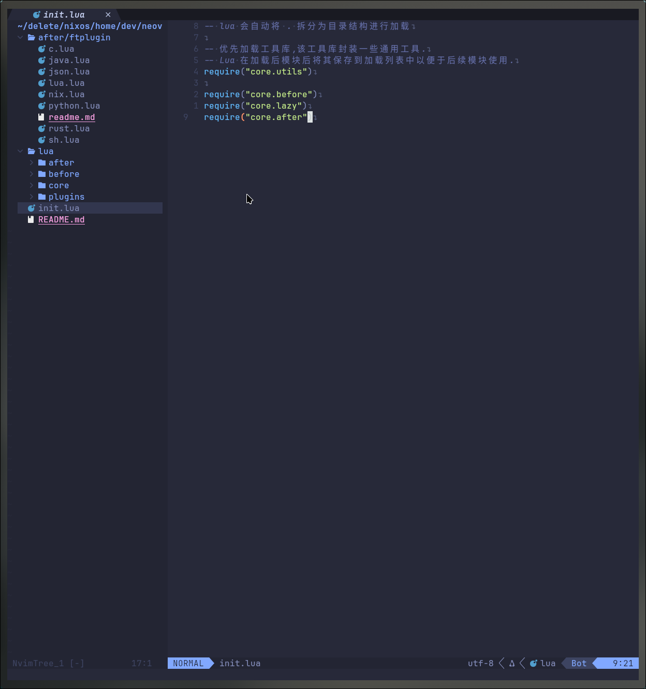
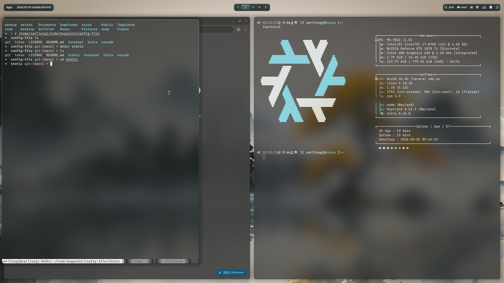

## 项目说明
* 该项目用以记录个人使用的 `dotfiles` 以及脚本.

### 项目截图




#### 使用 neovim 配置
* 将 [neovim](./terminal/nvim) 目录复制到 `~/.config/`,打开`neovim`等待插件下载即可.

#### 使用 NixOS 桌面配置
1. `NixOS` 桌面配置,它包含完整的系统环境配置,并且需要在`NixOS`下进行安装,复制 [nixos](./terminal/os/nixos)
   目录到 `NixOS` 配置目录下,需要备份已有的配置项,防止覆盖.
  ```bash
    sudo mv /etc/nixos ~/nixos.bak
    sudo cp -rL ./terminal/os/nixos /etc/nixos
  ```
2. 在 [config](./terminal/os/nixos/config) 中配置全局的一些变量,例如要使用的`系统用户名`.
3. 根据`设备硬件`来选择使用部分配置,例如 [nvidia](./terminal/os/nixos/auto-loading/desktop/graphics.nix),该
   文件引入了`Nvidia`的配置项.
4. 完成后执行系统构建即可.
  ```bash
    sudo nixos-rebuild switch --flake /etc/nixos#desktop \
      --option extra-experimental-features "pipe-operators"
  ```

### 维护说明 (Maintenance Notes)

本项目中 NixOS 桌面系统环境并非完全跟随 `mylinuxforwork/dotfiles` 的最新 Master 分支。

## 致谢 (Credits)

本仓库中的配置是我在折腾系统过程中，从 GitHub、V2EX、Reddit (r/unixporn) 以及 Stack Overflow 等社区不断学习、借鉴并“缝合”而来的。

由于部分代码片段收集时间较早，原作者信息已不可考。在此对所有无私分享代码的大佬表示深切感谢！

如果你发现仓库中引用了你的代码且未注明出处，请通过 Issue 告知，我会立即补全引用或按要求删除。

本项目基于 [mylinuxforwork/dotfiles](https://github.com/mylinuxforwork/dotfiles) 进行NixOS桌面系统环境定制。
感谢原作者提供的优秀 Hyprland 架构。所有原始代码权利归原作者所有，本项目修改部分同样遵循 GPL-3.0 协议。

## 许可证 (License)

本项目采用 [GNU General Public License v3.0](LICENSE) 协议授权。

本项目包含对第三方 GPL 代码的修改与集成。基于 GPL 的传染性与开源精神，本仓库的所有配置脚本及改造代码均在相同协议下开放。

